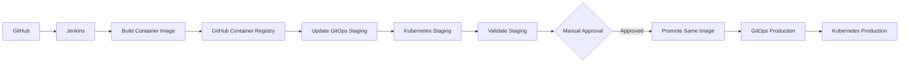

# Production DevOps Platform

A production-grade DevOps platform built on AWS using Infrastructure as Code, containerization, Kubernetes, CI/CD, and cloud-native monitoring.

---

## Project Goals

This project demonstrates how to design, provision, deploy, and monitor a production-ready cloud platform using modern DevOps tools and best practices.

---

## Technologies

- AWS
- Terraform
- Docker
- Kubernetes
- Helm
- GitHub Actions
- Nginx
- CloudWatch
- Prometheus
- Grafana

---

## Project Status

### ✅ Phase 1 – Infrastructure

- [x] Repository Structure
- [x] Reusable Terraform Networking Module
- [x] AWS VPC
- [x] Public Subnets
- [x] Private Subnets
- [x] Internet Gateway
- [x] NAT Gateway
- [ ] Security Module
- [ ] EC2 Module

---

### 🚧 Phase 2 – Application

- [ ] Docker
- [ ] Nginx
- [ ] Deploy Application

---

### 🚧 Phase 3 – CI/CD

- [ ] GitHub Actions
- [ ] Automated Deployment
- [ ] Rollback Strategy

---

### 🚧 Phase 4 – Kubernetes

- [ ] Kubernetes
- [ ] Helm
- [ ] Ingress
- [ ] TLS
- [ ] Horizontal Pod Autoscaler
- [ ] Prometheus
- [ ] Grafana

---

## Production CI/CD Pipeline

The Jenkins pipeline implements a controlled staging-to-production
deployment workflow.

### Pipeline Stages

- [x] Checkout source code
- [x] Verify AWS identity
- [x] Record current application version
- [x] Build versioned container image
- [x] Push container image to GitHub Container Registry
- [x] Update staging GitOps repository
- [x] Validate Kubernetes staging deployment
- [x] Manual production approval gate
- [x] Promote validated image to production
- [x] Verify production Kubernetes deployment
- [x] Jenkins success and failure notifications

### Artifact Promotion

Production does not rebuild the application after staging validation.

The pipeline promotes the exact immutable image that successfully passed
staging validation:

```text
Source Code
    |
    v
Jenkins Build
    |
    v
Versioned Container Image
    |
    +----> Staging ----> Validation ----> Manual Approval
                                      |
                                      v
                              Same Image Version
                                      |
                                      v
                                  Production

## Repository Structure

```
production-devops-platform
│
├── terraform/
├── app/
├── docs/
├── screenshots/
└── .github/
```

---

## Architecture

The platform uses a CI/CD and GitOps workflow with separate staging and
production environments.



The same immutable, versioned container image validated in staging is
promoted to production without rebuilding the artifact.

For the detailed architecture and deployment flow, see
[docs/architecture.md](docs/architecture.md).

## Author

**Ekerette Akpanyah**

Building production-grade DevOps projects to demonstrate real-world cloud engineering skills.

