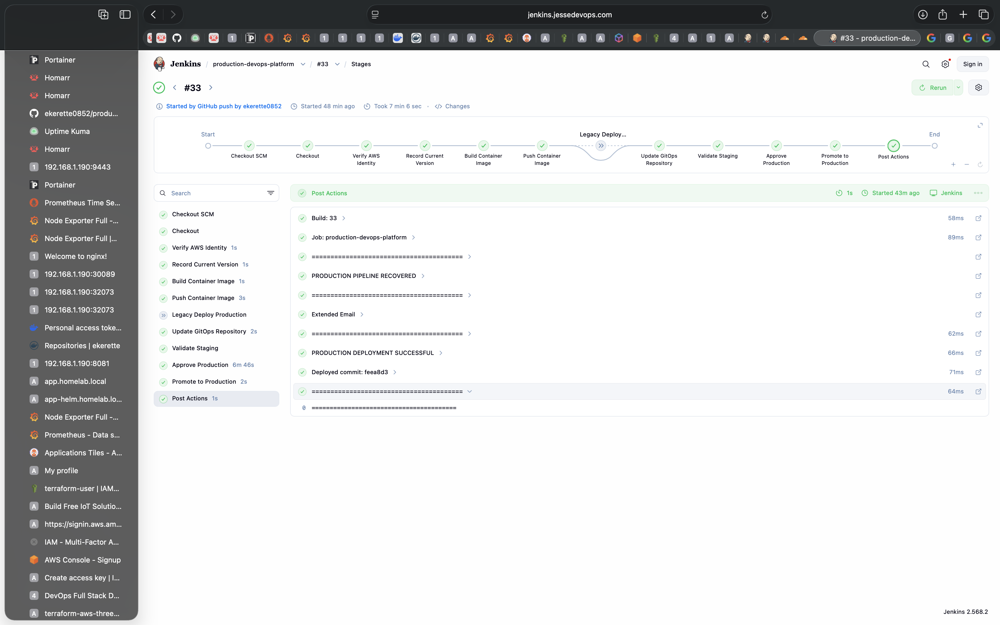
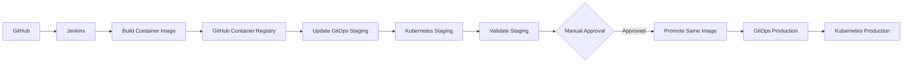

# Production DevOps Platform

A production-grade DevOps platform built on AWS using Infrastructure as Code, containerization, Kubernetes, CI/CD, and cloud-native monitoring.

---

## Project Goals

This project demonstrates how to design, provision, deploy, and monitor a production-ready cloud platform using modern DevOps tools and best practices.

---

## Technologies

- AWS
- Terraform
- Docker
- Kubernetes
- Helm
- GitHub Actions
- Nginx
- CloudWatch
- Prometheus
- Grafana

---

## Project Status

### ✅ Phase 1 – Infrastructure

- [x] Repository Structure
- [x] Reusable Terraform Networking Module
- [x] AWS VPC
- [x] Public Subnets
- [x] Private Subnets
- [x] Internet Gateway
- [x] NAT Gateway
- [ ] Security Module
- [ ] EC2 Module

---

### 🚧 Phase 2 – Application

- [ ] Docker
- [ ] Nginx
- [ ] Deploy Application

---

### 🚧 Phase 3 – CI/CD

- [x] GitHub Actions
- [x] Automated Deployment
- [ ] Rollback Strategy

---

### 🚧 Phase 4 – Kubernetes

- [ ] Kubernetes
- [ ] Helm
- [ ] Ingress
- [ ] TLS
- [ ] Horizontal Pod Autoscaler
- [ ] Prometheus
- [ ] Grafana

---

## Production CI/CD Pipeline

The Jenkins pipeline implements a controlled staging-to-production
deployment workflow.

### Pipeline Stages

- [x] Checkout source code
- [x] Verify AWS identity
- [x] Record current application version
- [x] Build versioned container image
- [x] Push container image to GitHub Container Registry
- [x] Update staging GitOps repository
- [x] Validate Kubernetes staging deployment
- [x] Manual production approval gate
- [x] Promote validated image to production
- [x] Verify production Kubernetes deployment
- [x] Jenkins success and failure notifications

### Artifact Promotion

Production does not rebuild the application after staging validation.

The pipeline promotes the exact immutable image that successfully passed
staging validation:

```text
Source Code
    |
    v
Jenkins Build
    |
    v
Versioned Container Image
    |
    +----> Staging ----> Validation ----> Manual Approval
                                      |
                                      v
                              Same Image Version
                                      |
                                      v
                                  Production
```

## Production Pipeline Evidence

The Jenkins production pipeline successfully promotes the same validated, versioned container image from staging to production after manual approval.



---

## Repository Structure

```
production-devops-platform
│
├── terraform/
├── app/
├── docs/
├── screenshots/
└── .github/
```

---

## Architecture

The platform uses a CI/CD and GitOps workflow with separate staging and
production environments.



The same immutable, versioned container image validated in staging is
promoted to production without rebuilding the artifact.

For the detailed architecture and deployment flow, see
[docs/architecture.md](docs/architecture.md).

## GitOps Production Deployment

The platform also implements a GitOps-based production deployment workflow using GitHub Actions and Argo CD.

### GitOps Workflow

```mermaid
flowchart LR
    A[Developer] --> B[GitHub Repository]
    B --> C[GitHub Actions]
    C --> D[Build and Test]
    D --> E[Versioned Container Image]
    E --> F[GitHub Container Registry]
    C --> G[Update GitOps Repository]
    G --> H[Argo CD]
    H --> I[Kubernetes Production]

### GitOps Deployment Flow

The production environment follows a GitOps deployment model.

1. A code change is pushed to the application repository.
2. GitHub Actions builds and tests the application.
3. A versioned Docker image is created.
4. The image is pushed to GitHub Container Registry (GHCR).
5. The production manifest in the GitOps repository is updated with the new image version.
6. Argo CD detects the Git repository change.
7. Argo CD synchronizes the desired state with the Kubernetes production cluster.
8. Kubernetes deploys the new version.

### Production Deployment Verification

The GitOps workflow has been successfully validated end-to-end.

- GitHub Actions CI pipeline: **Successful**
- Container image: `ghcr.io/ekerette0852/production-devops-app:1.0.1`
- GitOps manifest update: **Successful**
- Argo CD application: **Synced**
- Argo CD health status: **Healthy**
- Kubernetes production deployment: **Running version 1.0.1**

This architecture separates CI from deployment. GitHub Actions builds, tests, publishes, and updates the desired application version in Git, while Argo CD continuously reconciles the Kubernetes production environment with the state stored in the GitOps repository.

## Author

**Ekerette Akpanyah**

Building production-grade DevOps projects to demonstrate real-world cloud engineering skills.

