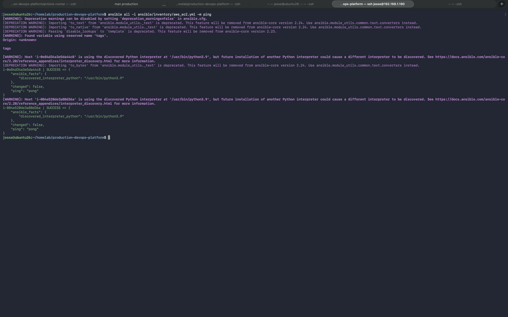
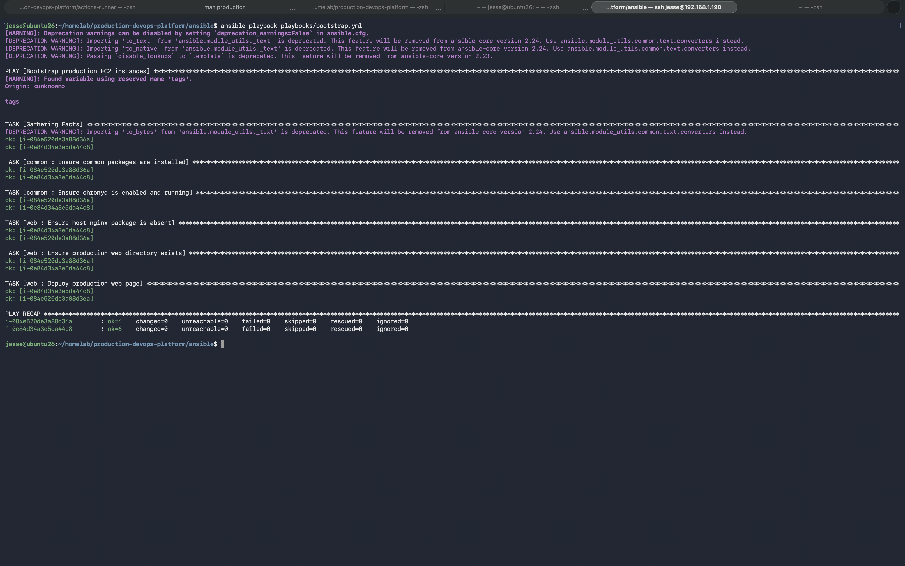
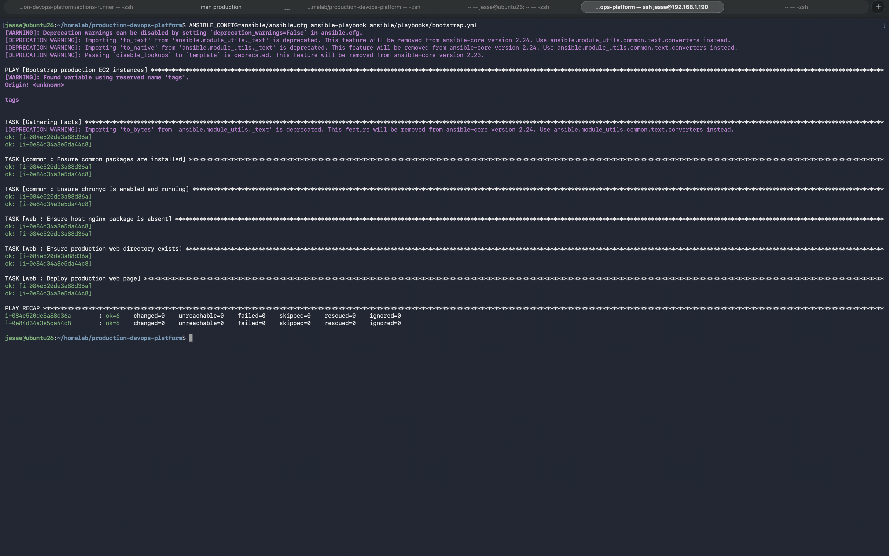

# Ansible AWS Automation

## Overview

This lab demonstrates infrastructure configuration and automation using
Ansible against dynamically discovered AWS EC2 instances.

The environment uses an AWS EC2 dynamic inventory to automatically discover
instances belonging to the production DevOps platform.

## Architecture

Ansible Control Node
        |
        v
AWS EC2 Dynamic Inventory
        |
        v
Auto Scaling Group
        |
        +--- EC2 Instance 1
        |
        +--- EC2 Instance 2

## What Was Automated

The Ansible playbook performs the following tasks:

- Discovers AWS EC2 instances dynamically
- Connects to discovered instances over SSH
- Gathers system facts
- Installs required common packages
- Ensures chronyd is enabled and running
- Verifies the nginx package state
- Creates the production web directory
- Deploys the production web page

## Validation

Connectivity was verified using the Ansible ping module.

Both dynamically discovered EC2 instances returned:

SUCCESS
ping: pong

The bootstrap playbook completed successfully across both instances with:

- failed=0
- unreachable=0

A subsequent execution completed with:

- changed=0

This demonstrates idempotent configuration management.

## Technologies

- Ansible
- AWS EC2
- AWS Auto Scaling
- Dynamic Inventory
- YAML
- SSH
- Linux

## Evidence

### AWS Dynamic Inventory

The AWS EC2 dynamic inventory automatically discovered the EC2 instances
belonging to the production Auto Scaling Group.

### Ansible Connectivity

The Ansible ping module verified successful connectivity to both dynamically
discovered EC2 instances.

### Playbook Execution

The production bootstrap playbook completed successfully across both EC2
instances with no failed or unreachable hosts.

### Idempotency Verification

The playbook was executed again after the desired configuration had already
been applied. Both hosts reported `changed=0`, demonstrating that the
automation is idempotent.

