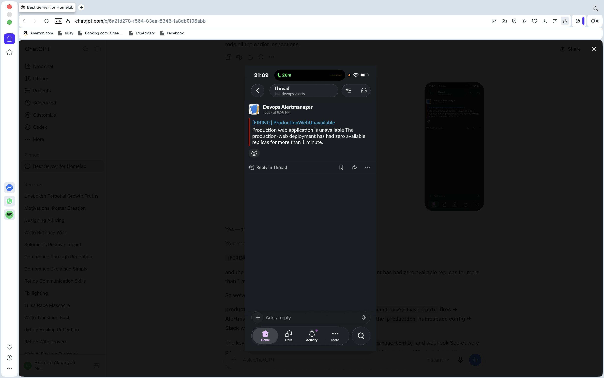
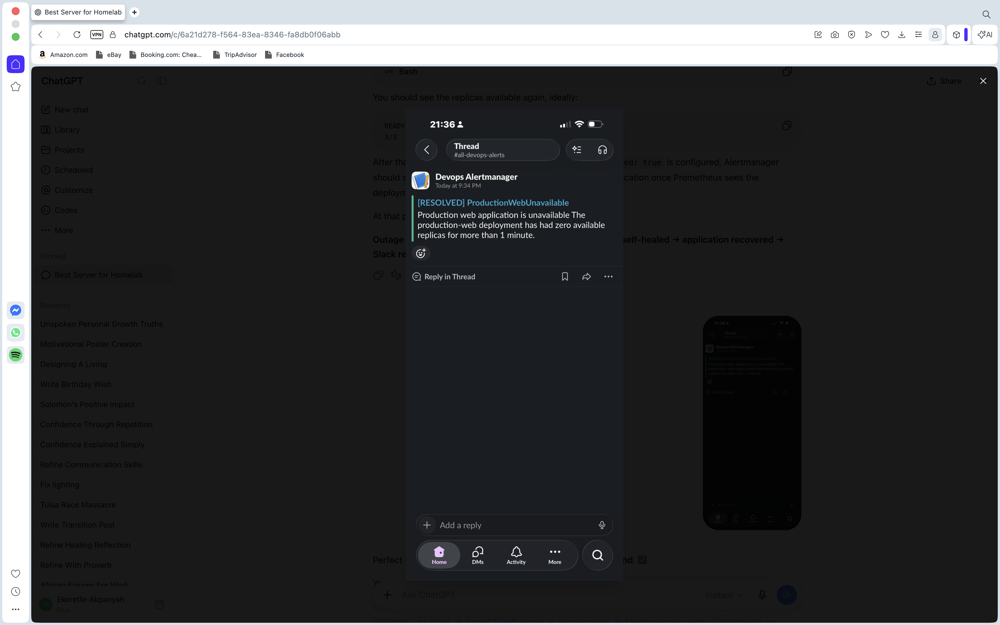

# Production Incident Alerting and Argo CD Self-Healing

## Project Overview

This lab demonstrates an end-to-end production-style incident detection,
alerting, notification, recovery, and resolution workflow using Kubernetes,
Prometheus, Alertmanager, Slack, and Argo CD.

The goal was to simulate a real application outage and verify that the
monitoring platform could:

1. Detect application unavailability
2. Trigger a Prometheus alert
3. Forward the firing alert to Alertmanager
4. Route the alert to Slack
5. Restore the application using Argo CD self-healing
6. Automatically send a resolved notification to Slack

---

## Architecture

```text
Production Kubernetes Deployment
          |
          v
      Prometheus
          |
          v
PrometheusRule
ProductionWebUnavailable
          |
          v
     Alertmanager
          |
          v
 AlertmanagerConfig
          |
          v
    Slack Webhook
          |
          v
 #all-devops-alerts

---

## Incident Evidence

### 1. Production Failure Detected

The `production-web` deployment was intentionally scaled to zero replicas to simulate a production outage. Prometheus detected that the application had no available replicas, and Alertmanager routed the firing alert to Slack.



### 2. Automated Recovery

Argo CD self-healing detected that the live Kubernetes state had drifted from the desired state stored in Git and automatically restored the `production-web` deployment.

The application returned to a healthy and synchronized state without requiring a manual redeployment.

### 3. Incident Resolved

After the production replicas became available again, Prometheus evaluated the alert condition as healthy. Alertmanager then automatically sent the resolved notification to Slack.



## Result

This lab demonstrates an end-to-end production incident response workflow:

**Kubernetes failure → Prometheus detection → Alertmanager → Slack alert → Argo CD self-healing → Service recovery → Slack resolved notification**

The test validates both observability and automated remediation within the production Kubernetes environment.
